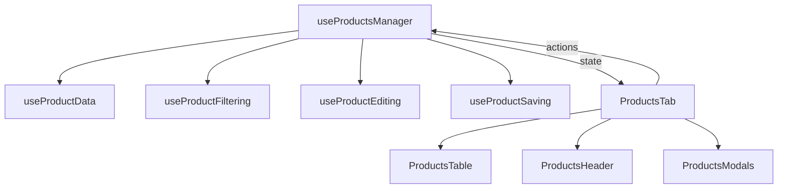

# Архитектура модуля "Товары"

**Компонент:** `features/products/components/ProductsTab.tsx`
**Основной хук:** `features/products/hooks/useProductsManager.ts`

## 1. Общая концепция
Модуль построен на принципе **композиции хуков**. Основной компонент `ProductsTab` является "тонким" контейнером. Он не содержит бизнес-логики, а лишь получает данные и функции от `useProductsManager` и распределяет их по дочерним компонентам.

## 2. Структура `useProductsManager`
Этот хук является "Фасадом" для 8 специализированных суб-хуков.

### Поток данных
1.  **`useProductData`**: 
    *   Отвечает за загрузку (`fetchData`) и хранение "сырых" данных (`items`, `albums`).
    *   Реализует **двухуровневое кеширование**: данные сохраняются в `localStorage` (`market-data-{projectId}`). При инициализации данные берутся из стораджа, а в фоне происходит проверка актуальности.
2.  **`useProductFiltering`**: 
    *   Принимает сырые данные.
    *   Возвращает `filteredItems` на основе поиска (`searchQuery`) и выбранного альбома (`activeAlbumId`).
3.  **`useProductEditing`**:
    *   Хранит **дельта-изменения** (`editedItems`). Это словарь `Record<itemId, Partial<MarketItem>>`.
    *   Хранит новые фото (`pendingPhotos`).
    *   Хранит список на удаление (`itemsToDelete`).
    *   *Принцип:* Мы не мутируем исходный массив `items`. При рендеринге таблицы мы накладываем `editedItems` поверх `items`.

### Взаимодействие компонентов

## 3. Ключевые состояния (State)
*   **`isDirty`**: Вычисляемое свойство. `true`, если есть ключи в `editedItems`, `pendingPhotos` или `itemsToDelete`. Активирует кнопку "Сохранить все".
*   **`selectionState`**: Управляется хуком `useProductSelection`. Позволяет выбирать товары для массовых операций.