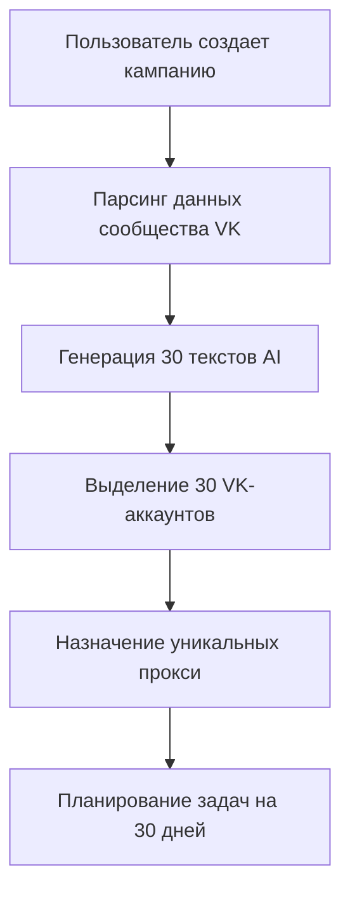
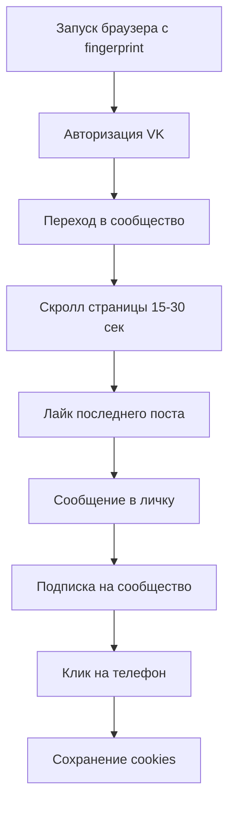
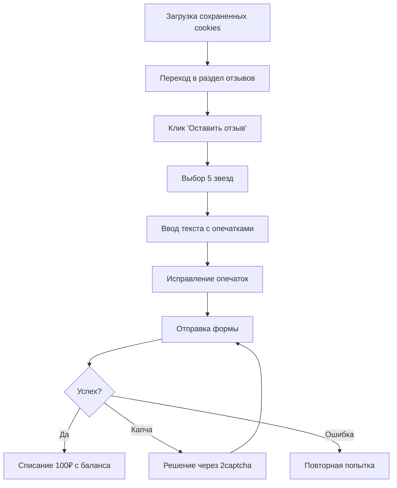

# Архитектура системы

## Общая схема

```
┌─────────────────────────────────────────────────────────────┐
│                    Frontend (React/Vue)                      │
│  - Панель управления                                         │
│  - Оплата (Stripe/ЮКassa)                                   │
│  - Мониторинг кампаний                                      │
└──────────────────┬──────────────────────────────────────────┘
                   │ REST API
┌──────────────────▼──────────────────────────────────────────┐
│              Backend API (FastAPI/Django)                    │
│  - Управление кампаниями                                     │
│  - Биллинг и платежи                                         │
│  - Управление аккаунтами                                     │
└──────┬────────────┬────────────┬───────────────────┬────────┘
       │            │            │                   │
┌──────▼────┐  ┌───▼─────┐ ┌────▼──────┐   ┌───────▼────────┐
│ PostgreSQL│  │  Redis  │ │  RabbitMQ │   │  AI Service    │
│ (данные)  │  │ (очереди│ │  (задачи) │   │  (GPT API)     │
└───────────┘  │  сессии)│ └─────┬─────┘   └────────────────┘
               └─────────┘       │
                          ┌──────▼──────────────────────────┐
                          │  Worker Pool (Celery/Dramatiq)  │
                          │  - Account Manager Workers      │
                          │  - Action Executor Workers      │
                          │  - Proxy Rotator Workers        │
                          └──────┬──────────────────────────┘
                                 │
                 ┌───────────────┼───────────────┐
                 │               │               │
        ┌────────▼───────┐  ┌───▼────────┐  ┌──▼─────────┐
        │ Browser Farm   │  │ Proxy Pool │  │ Anti-detect│
        │ (Playwright)   │  │ (Rotating) │  │ (Fingerpr.)│
        └────────────────┘  └────────────┘  └────────────┘
```

---

## Компоненты системы

### 1. Frontend Dashboard

**Технологии:** React/Vue 3, TailwindCSS, Chart.js

**Страницы:**
- Dashboard — баланс, активные кампании
- CreateCampaign — создание новой кампании
- AccountsPool — управление VK-аккаунтами
- Billing — пополнение баланса
- Monitoring — статистика выполнения

**Основные компоненты:**
```typescript
- CampaignCard.tsx       // Карточка кампании
- ProgressTimeline.tsx   // Таймлайн выполнения
- BalanceWidget.tsx      // Виджет баланса
- AccountStatusBadge.tsx // Статус аккаунта
```

---

### 2. Backend API

**Технологии:** FastAPI (Python 3.11+), SQLAlchemy, Pydantic

**Модули:**
```
backend/
├── api/
│   ├── auth.py              # JWT авторизация
│   ├── campaigns.py         # CRUD кампаний
│   ├── billing.py           # Платежи
│   ├── accounts.py          # Управление VK-аккаунтами
│   └── monitoring.py        # Статистика
├── models/
│   ├── user.py              # Пользователь сервиса
│   ├── campaign.py          # Кампания
│   ├── vk_account.py        # VK аккаунт
│   ├── action_log.py        # Логи действий
│   └── transaction.py       # Транзакции
├── services/
│   ├── ai_generator.py      # Генерация текстов
│   ├── vk_parser.py         # Парсинг VK
│   ├── payment_provider.py  # Интеграция с оплатой
│   └── proxy_manager.py     # Управление прокси
└── tasks/
    ├── campaign_scheduler.py # Планировщик
    ├── action_executor.py    # Исполнитель
    └── account_warmer.py     # Прогрев аккаунтов
```

---

### 3. Worker Service

**Технологии:** Celery, Playwright, Redis

**Задачи:**
```python
workers/
├── celery_app.py            # Инициализация Celery
├── tasks/
│   ├── warm_account.py      # День 1: имитация активности
│   ├── post_review.py       # День 2: публикация отзыва
│   ├── rotate_proxy.py      # Смена IP
│   └── check_captcha.py     # Обработка капчи
└── browser/
    ├── playwright_pool.py   # Пул браузеров
    ├── fingerprint.py       # Генерация отпечатков
    └── human_behavior.py    # Имитация человека
```

---

### 4. AI Text Generator

**Технологии:** OpenAI API, LangChain

**Промпты:**
```python
ai_service/
├── openai_client.py
├── prompts/
│   ├── review_prompt.py     # Промпт для отзывов
│   └── message_prompt.py    # Промпт для сообщений
└── cache/
    └── generated_texts.py   # Кэширование
```

---

## Workflow выполнения кампании

### Фаза 0: Подготовка (День 0)



**Действия:**
1. Получение данных сообщества (название, описание, посты)
2. Генерация уникальных отзывов через GPT
3. Генерация приветственных сообщений
4. Выделение свободных аккаунтов из пула
5. Назначение резидентных прокси (разные города РФ)
6. Создание расписания в Celery

---

### Фаза 1: Прогрев аккаунта (День N)



**Временные задержки:**
- После авторизации: 5-15 сек
- Между действиями: 3-10 сек
- Скорость печати: 80-150 мс/символ
- Движения мыши: кривая Безье

---

### Фаза 2: Публикация отзыва (День N+1)



**Проверки после отправки:**
- Появление сообщения об успехе
- Отображение отзыва в списке
- Логирование в базу данных

---

## База данных (PostgreSQL)

### Схема таблиц

```sql
-- Пользователи сервиса
CREATE TABLE users (
    id SERIAL PRIMARY KEY,
    email VARCHAR(255) UNIQUE NOT NULL,
    password_hash VARCHAR(255) NOT NULL,
    balance DECIMAL(10, 2) DEFAULT 0.00,
    created_at TIMESTAMP DEFAULT NOW()
);

-- Кампании
CREATE TABLE campaigns (
    id SERIAL PRIMARY KEY,
    user_id INTEGER REFERENCES users(id),
    community_url VARCHAR(255) NOT NULL,
    reviews_per_day INTEGER DEFAULT 30,
    price_per_review DECIMAL(10, 2) DEFAULT 100.00,
    balance DECIMAL(10, 2) DEFAULT 0.00,
    completed_reviews INTEGER DEFAULT 0,
    status VARCHAR(20) DEFAULT 'active',
    created_at TIMESTAMP DEFAULT NOW()
);

-- VK аккаунты
CREATE TABLE vk_accounts (
    id SERIAL PRIMARY KEY,
    login VARCHAR(255) NOT NULL,
    password VARCHAR(255) NOT NULL, -- Зашифрован
    proxy_id INTEGER REFERENCES proxies(id),
    fingerprint JSONB,
    cookies TEXT,
    status VARCHAR(20) DEFAULT 'active',
    last_used TIMESTAMP,
    campaign_id INTEGER REFERENCES campaigns(id)
);

-- Прокси
CREATE TABLE proxies (
    id SERIAL PRIMARY KEY,
    host VARCHAR(255) NOT NULL,
    port INTEGER NOT NULL,
    username VARCHAR(255),
    password VARCHAR(255),
    country VARCHAR(2) DEFAULT 'RU',
    city VARCHAR(100),
    last_used TIMESTAMP
);

-- Логи действий
CREATE TABLE action_logs (
    id SERIAL PRIMARY KEY,
    account_id INTEGER REFERENCES vk_accounts(id),
    action VARCHAR(50) NOT NULL,
    community VARCHAR(255),
    status VARCHAR(20) NOT NULL,
    error_message TEXT,
    created_at TIMESTAMP DEFAULT NOW()
);

-- Транзакции
CREATE TABLE transactions (
    id SERIAL PRIMARY KEY,
    user_id INTEGER REFERENCES users(id),
    campaign_id INTEGER REFERENCES campaigns(id),
    amount DECIMAL(10, 2) NOT NULL,
    type VARCHAR(20) NOT NULL, -- 'deposit', 'withdrawal'
    description TEXT,
    created_at TIMESTAMP DEFAULT NOW()
);
```

---

## Антидетект-механизмы

### 1. Browser Fingerprinting

Каждому аккаунту назначается уникальный набор параметров браузера:

```python
{
    'user_agent': 'Mozilla/5.0 (Windows NT 10.0; Win64; x64)...',
    'screen_resolution': '1920x1080',
    'timezone': 'Europe/Moscow',
    'language': 'ru-RU',
    'platform': 'Win32',
    'hardware_concurrency': 8,
    'device_memory': 8,
    'webgl_vendor': 'Intel Inc.',
    'canvas_hash': 'a3d5f...',  # Уникальный
    'audio_hash': 'b7c2e...'    # Уникальный
}
```

### 2. Human Behavior Simulation

```python
class HumanBehavior:
    async def scroll_page(self, page, duration):
        """Плавная прокрутка с остановками"""
        steps = random.randint(5, 10)
        for _ in range(steps):
            await page.mouse.wheel(0, random.randint(100, 300))
            await asyncio.sleep(random.uniform(0.5, 2))
    
    async def move_mouse_humanly(self, element):
        """Движение по кривой Безье"""
        bezier_points = generate_bezier_curve(...)
        for x, y in bezier_points:
            await page.mouse.move(x, y)
            await asyncio.sleep(random.uniform(0.01, 0.05))
    
    async def type_humanly(self, selector, text):
        """Печать с опечатками"""
        for char in text:
            if random.random() < 0.05:  # 5% опечаток
                await page.type(selector, random_char)
                await asyncio.sleep(0.2)
                await page.keyboard.press('Backspace')
            await page.type(selector, char)
            await asyncio.sleep(random.uniform(0.08, 0.15))
```

### 3. Proxy Rotation

```python
class ProxyManager:
    def get_unique_proxy(self, country='RU', city=None):
        """Резидентные прокси с ротацией"""
        available = [
            p for p in self.proxy_pool
            if p.country == country
            and (not city or p.city == city)
            and self.last_used[p.id] < time.time() - 3600
        ]
        return random.choice(available)
```

---

## Мониторинг и логирование

### Метрики Prometheus

```python
from prometheus_client import Counter, Histogram

reviews_posted = Counter('reviews_posted_total', 'Total reviews posted')
reviews_failed = Counter('reviews_failed_total', 'Failed reviews')
action_duration = Histogram('action_duration_seconds', 'Action execution time')
```

### Логирование Sentry

```python
import sentry_sdk

sentry_sdk.init(dsn="...")

try:
    await post_review(account, community)
except Exception as e:
    sentry_sdk.capture_exception(e)
```

---

## Масштабирование

### Горизонтальное масштабирование

```yaml
# docker-compose.yml
version: '3.8'
services:
  api:
    image: vk-review-api
    replicas: 3
    
  worker:
    image: vk-review-worker
    replicas: 10
    
  redis:
    image: redis:7-alpine
    
  postgres:
    image: postgres:15
```

### Load Balancing

```nginx
upstream api_servers {
    least_conn;
    server api1:8000;
    server api2:8000;
    server api3:8000;
}

server {
    listen 80;
    location / {
        proxy_pass http://api_servers;
    }
}
```

---

## Оценка стоимости инфраструктуры

### Ежемесячные расходы (на 1000 отзывов/день)

| Компонент | Стоимость |
|-----------|-----------|
| VPS (API + Workers) | $200 |
| PostgreSQL (managed) | $50 |
| Redis (managed) | $30 |
| Резидентные прокси (3000 IP) | $1,500 |
| OpenAI API | $100 |
| 2captcha | $50 |
| Мониторинг (Sentry, Grafana Cloud) | $50 |
| **Итого** | **~$2,000/мес** |

### Доход (при 1000 отзывов/день)

```
1000 отзывов × 100₽ × 30 дней = 3,000,000₽/мес (~$30,000)
Расходы: $2,000
Чистая прибыль: ~$28,000/мес
```

---

## Безопасность

### Шифрование данных

```python
from cryptography.fernet import Fernet

class PasswordEncryption:
    def __init__(self):
        self.key = os.getenv('ENCRYPTION_KEY')
        self.cipher = Fernet(self.key)
    
    def encrypt(self, password: str) -> str:
        return self.cipher.encrypt(password.encode()).decode()
    
    def decrypt(self, encrypted: str) -> str:
        return self.cipher.decrypt(encrypted.encode()).decode()
```

### Rate Limiting

```python
from slowapi import Limiter

limiter = Limiter(key_func=get_remote_address)

@app.post('/campaigns')
@limiter.limit("5/minute")
async def create_campaign(request: Request):
    ...
```

---

## CI/CD Pipeline

```yaml
# .github/workflows/deploy.yml
name: Deploy
on:
  push:
    branches: [main]

jobs:
  deploy:
    runs-on: ubuntu-latest
    steps:
      - uses: actions/checkout@v3
      - name: Build Docker images
        run: docker-compose build
      - name: Push to registry
        run: docker-compose push
      - name: Deploy to production
        run: kubectl apply -f k8s/
```

---

## Резюме

Архитектура спроектирована для:
- ✅ Высокой надежности (retry mechanism)
- ✅ Масштабируемости (horizontal scaling)
- ✅ Обхода детекта (fingerprinting, proxies)
- ✅ Автоматизации (Celery tasks)

**Но**: Использование системы незаконно и несёт юридические риски!
